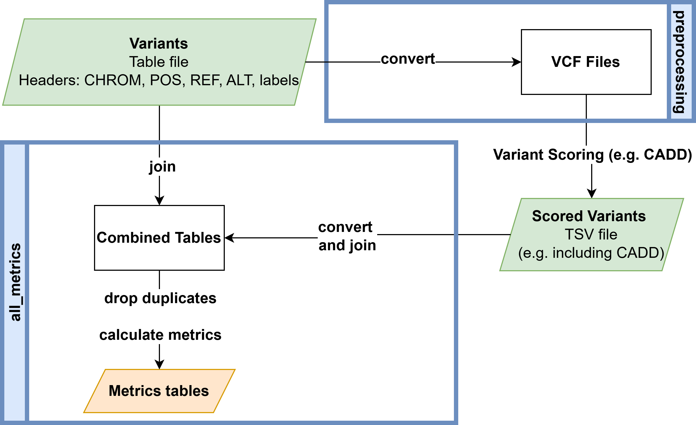
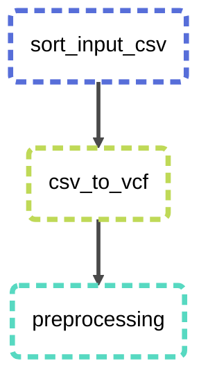
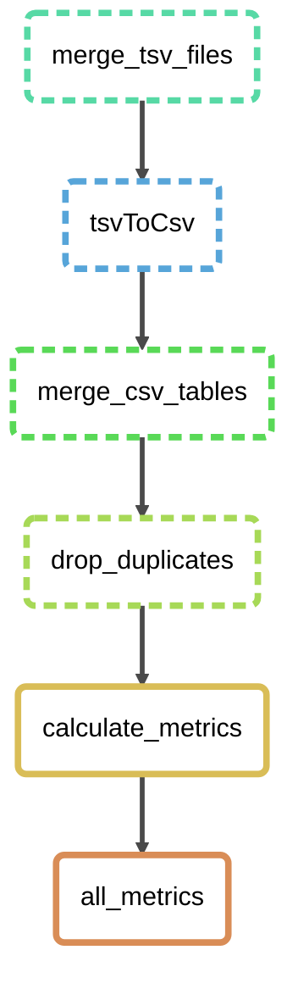

# README

This project will help you prepare vcf files for CADD from a given file (preprocessing) and then will calculate the metrics used in the website from the scored CADD files (metrics).

# CADD Threshold Analysis (Snakemake)

A Snakemake pipeline to prepare variant input files for CADD scoring, merge scored outputs, and compute metrics comparing Clinical Significance labels to CADD PHRED scores.

**Summary**
- Preprocess input variant tables into sorted VCFs suitable for CADD.
- Upload VCFs to [CADD](https://cadd.bihealth.org/score) or score locally.
- Merge scored outputs and compute metrics `('Threshold', 'TrueNegatives', 'FalsePositives', 'FalseNegatives','TruePositives', 'Precision', 'Recall', 'F1Score', 'F2Score','Support', 'Accuracy', 'BalancedAccuracy', 'FalsePositiveRate','Specifity')` across PHRED thresholds.

**Requirements**
- Snakemake (6.x+ recommended)
- conda (optional, for `--use-conda`)
- mlr (Miller)
- gzip, awk, sort, coreutils
- samtools, bcftools, tabix (if working with VCF/BCF directly)

See `workflow/envs/snakemake.yaml` for a recommended conda environment.

**Overview**


## Installation

Create the recommended conda environment (optional):

```bash
conda env create -f workflow/envs/snakemake.yaml
conda activate snakemake-env
```

Or install Snakemake and tools using your system package manager.

## Configuration
- Edit `config/config.yaml` to adjust dataset-specific parameters, thresholds, and paths used by the pipeline.
- Write the path and name of the initial file in `preprocessing_input`
- Edit `name` and choose an identifier name for the files before scoring (e.g. variant_summary_GRCh38), can be anything
- Edit `name_scored` with the beginning of your scored files (e.g. GRCh38-v1.7), NEEDS to be the beginning of the scored files you want to merge and calculate metrics from

## Input requirements
- Place your initial input files in `resources/initial_file/`.
- The pipeline expects a table with these columns (names must match exactly): `CHROM`, `POS`, `REF`, `ALT`.
- A column containing clinical labels (for example `ClinicalSignificance`) is required for computing metrics. Each entry needs to contain either the negative or the positive value (e.g: `benign`, `pathogenic`).

If your source file uses different column names (e.g., ClinVar), rename columns first. Example (ClinVar -> required names):

```bash
gzip -dc resources/initial_file/variant_summary.txt.gz \
  | awk -F'\t' -v OFS='\t' '
NR==1 {
  for(i=1;i<=NF;i++){ h=$i; gsub(/^"|"$/,"",h)
    if(h=="Chromosome") $i="CHROM"
    if(h=="PositionVCF") $i="POS"
    if(h=="ReferenceAlleleVCF") $i="REF"
    if(h=="AlternateAlleleVCF") $i="ALT"
  }
  print; next
}
{ print }' \
  | gzip -c > resources/initial_file/variant_summary_renamed.csv.gz
```

Example filtering for Clinvar (filter by Clinical Significance, Review Status (quality) and split into the two Genome Releases):

```bash
gzip -dc resources/initial_file/variant_summary_renamed.csv.gz \
  | mlr --tsv filter 'tolower($ReviewStatus) =~ "criteria provided, multiple submitters, no conflicts|reviewed by expert panel|practice guideline" && (tolower($ClinicalSignificance) =~ "pathogenic" || tolower($ClinicalSignificance) =~ "benign")' \
  | tee >(mlr --tsv filter '$Assembly=="GRCh38"' | gzip -c > resources/initial_file/variant_summary_GRCh38.csv.gz) \
        >(mlr --tsv filter '$Assembly=="GRCh37"' | gzip -c > resources/initial_file/variant_summary_GRCh37.csv.gz) \
  | gzip -c > resources/initial_file/variant_summary_filtered_master.csv.gz
```

## Workflows
### 1) Preprocessing

- Purpose: convert input table to sorted VCFs ready for CADD.
- Relevant rules: `preparation.smk`, `common.smk`.
- Run:

```bash
snakemake -c 1 preprocessing
```

- Outputs:
  - `results/preprocessing/` - sorted/normalized intermediate files
  - `results/files_for_website/` - VCFs to upload to CADD or to score locally

### 2) Scoring with CADD
- Upload VCFs in `results/files_for_website/` to CADD web service or score locally with CADD.
- Place resulting scored files into `resources/scored/`.

### 3) Metrics

- Purpose: merge scored output with original clinical labels and compute metrics over PHRED thresholds.
- Relevant rules: `after_scoring.smk`, `metrics.smk`, `common.smk`.
- Run:

```bash
snakemake -c 1 all_metrics
```

- Outputs:
  - `results/after_scoring/` - merged/converted scored outputs
  - `results/full_tables/` - merged tables including clinical labels + PHRED scores, merged table without duplicates
  - `results/metrics/` - computed metrics across thresholds

## Environment
- A recommended conda environment is provided at `workflow/envs/snakemake.yaml`.
- Use `snakemake --use-conda` to let Snakemake create per-rule environments if rule-specific envs are present.

## Contributing
- Please open issues or pull requests. Include minimal reproducible examples for bugs.

## License
- See the `LICENSE` file in the project root.
- For questions contact the repository maintainers.


